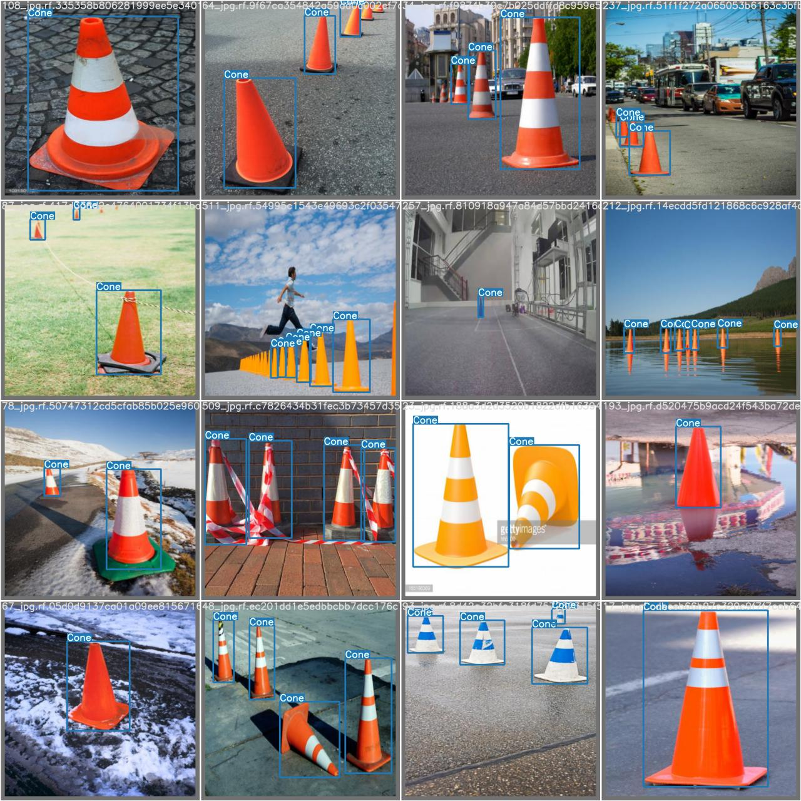
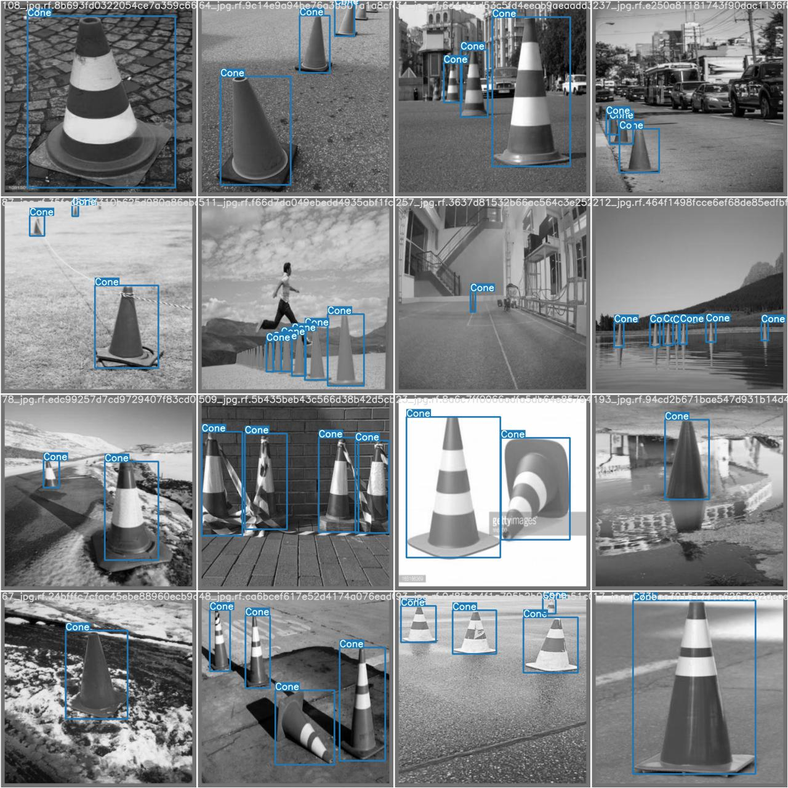
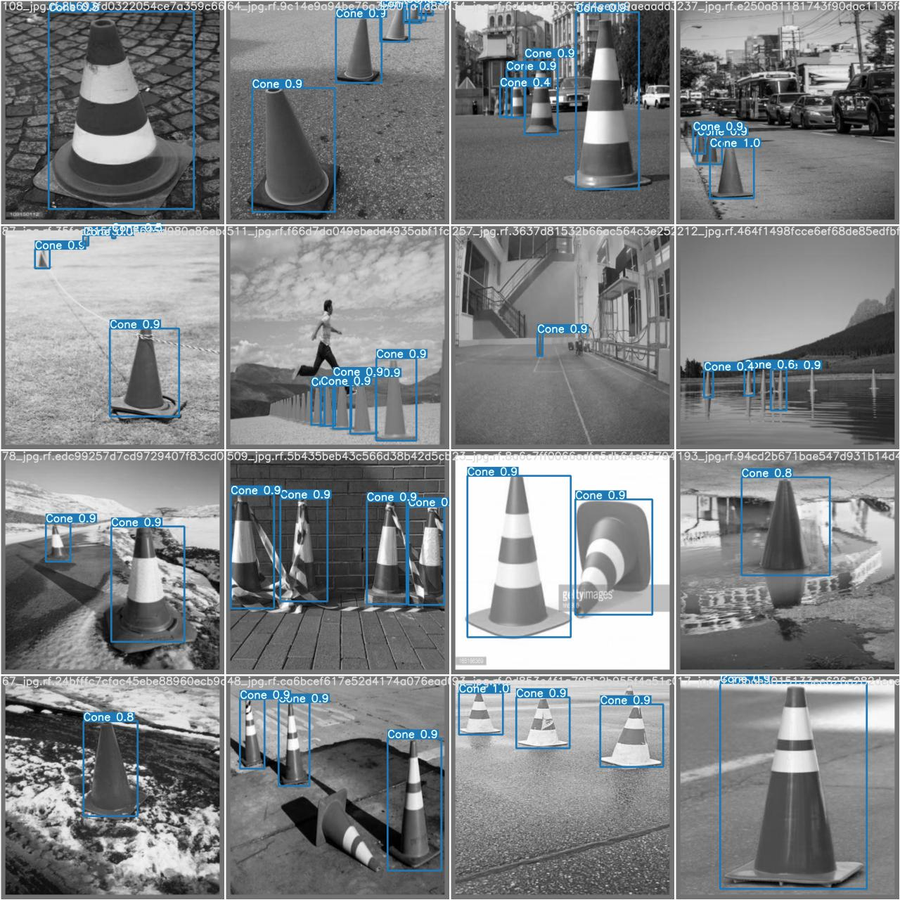
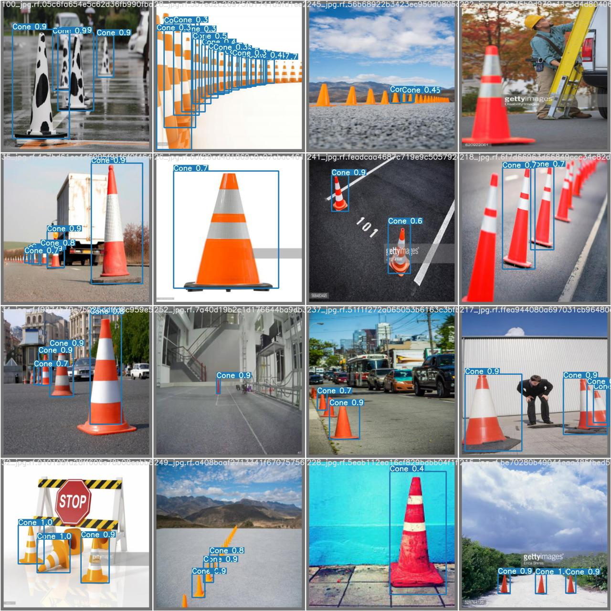
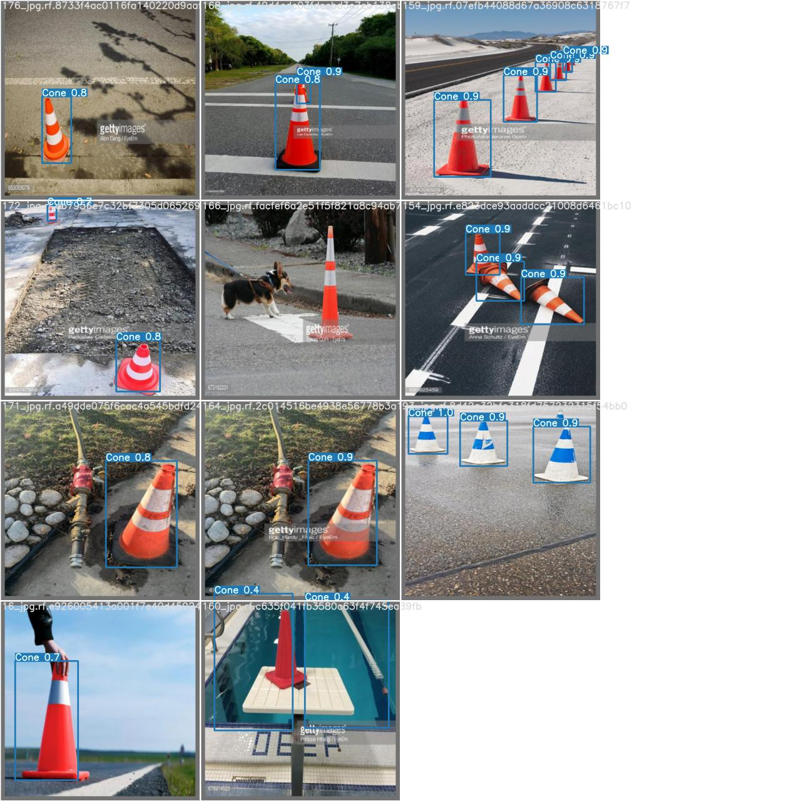

# YOLOv5-s-cone-detection


### This repo contains the model for YOLOv5 cone detection and the training data set


**The pretrained model is trained by using the following code:**

```
cd yolov5

python train.py --img 640 --batch 16 --epochs 5 --data cone.yaml --weights best.pt

```

**To train your own model, follow the following tutorial**
https://github.com/ultralytics/yolov5/wiki/Train-Custom-Data


**To test the model, use the following**

```
python test.py --data test.yaml --weights your_weights_file.pt
```

Change the test.yaml file in data folder to use different validation images.

**best.pt** can be replaced by **last.pt** or **best.pt** from different runs in the **runs** folder.

Data for each run can be found in **runs** folder.


**Most Recent work**

Besides the yolo5s model that is trained on normal cones(**best_colored.pt**), I also trained another yolo5s model on the gray scale pictures of the same dataset(**best_gray.pt**). The result was surprisingly good.

The old model can detect orange, right-side-up cones pretty well, but not so much for cones that have different colors. While the new model, which was trained totally on gray scale images, despite missing some of the orange cones, has a much better performance on cones of different colors. The results can be found in **runs/test** folder.


**Old Model (Trained on colored images)**

**Labeled data for old model**


**Predicted data for old model**


**New Model (Trained on colored images)**

**Performance on gray scale images**



**Performance on colored images**





The source of data is this repo:
	https://github.com/MarkDana/RealtimeConeDetection

Where the author labelled this dataset: 
	https://www.dropbox.com/s/fag8b45ijv14noy/cone_dataset.tar.gz?dl=0

The labelled dataset (In PASCAL VOC format, and YOLOv3 format):
	https://jbox.sjtu.edu.cn/v/link/view/5b75acf81cbd4e3298aa118c1b1cceea

Which I later converted to darknet format for Yolov5


------------------------------------------------------------------------

03/09/2021 Update

Trying out some image augmentation Using Albumentations: https://albumentations.ai/docs/getting_started/bounding_boxes_augmentation/

It supports the yolo darknet format for bounding box data.

I will train a new model with augmented dataset soon.


