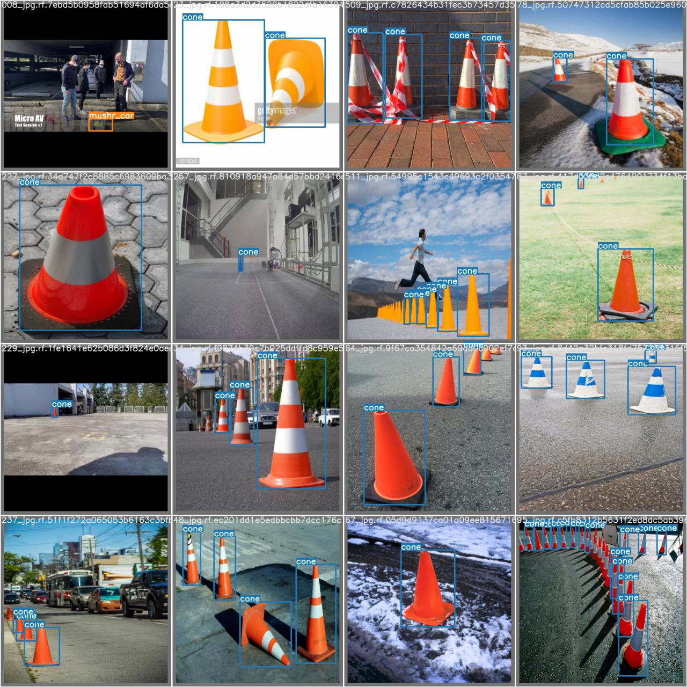
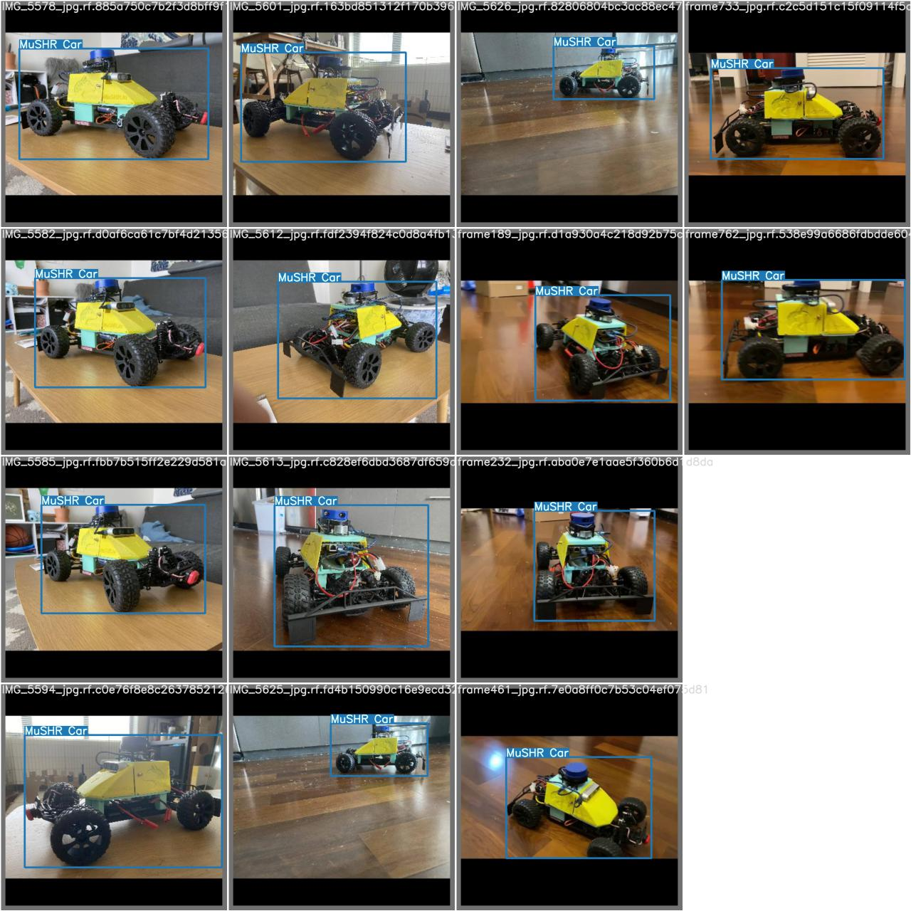
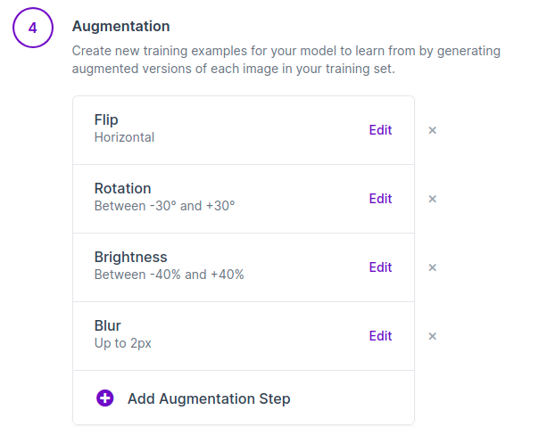
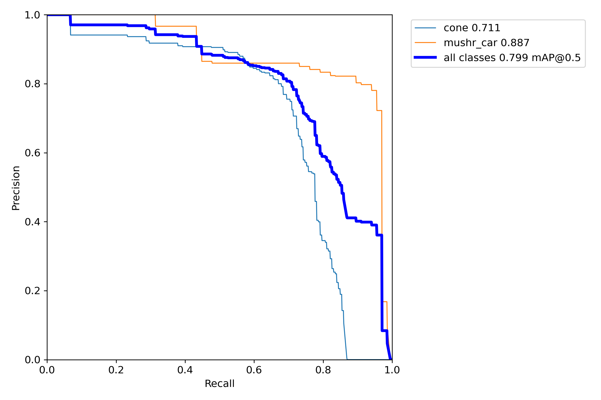
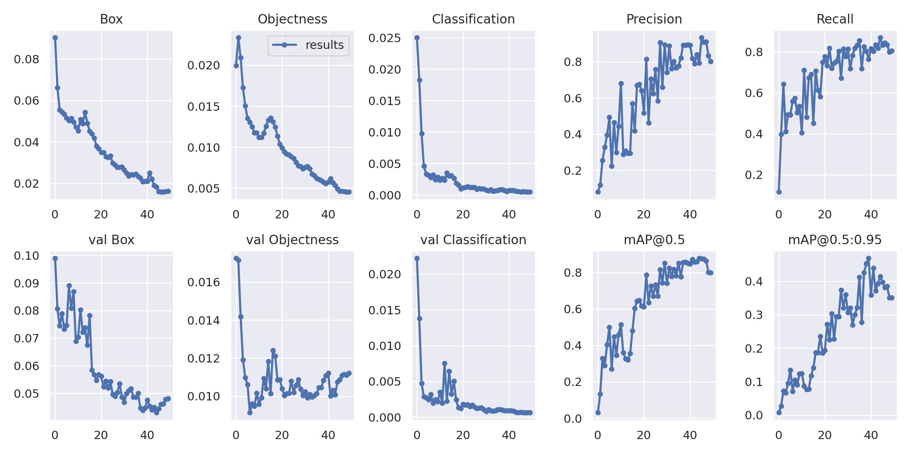
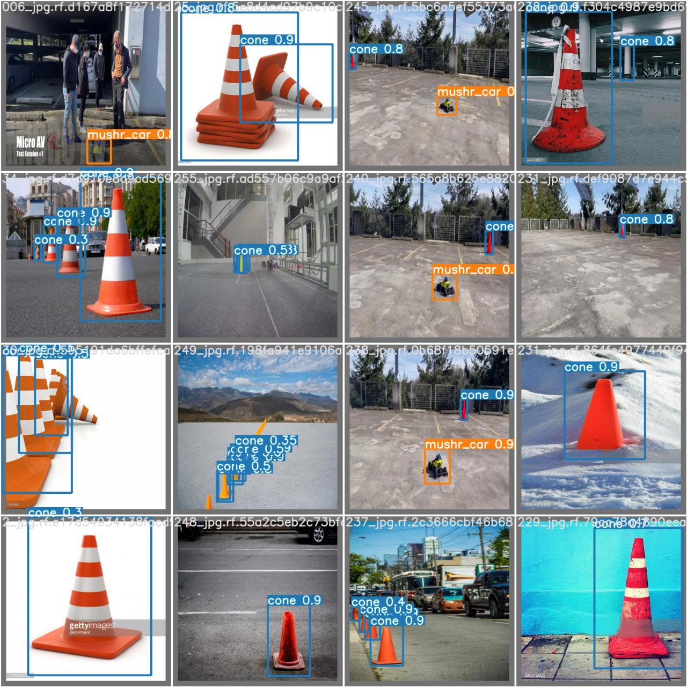
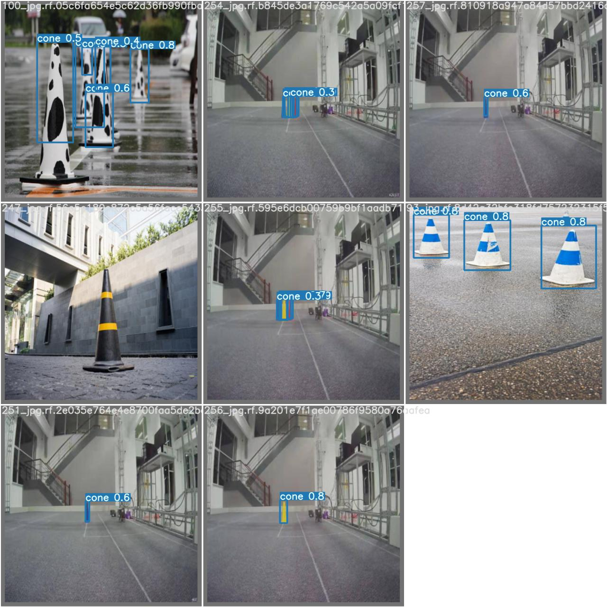
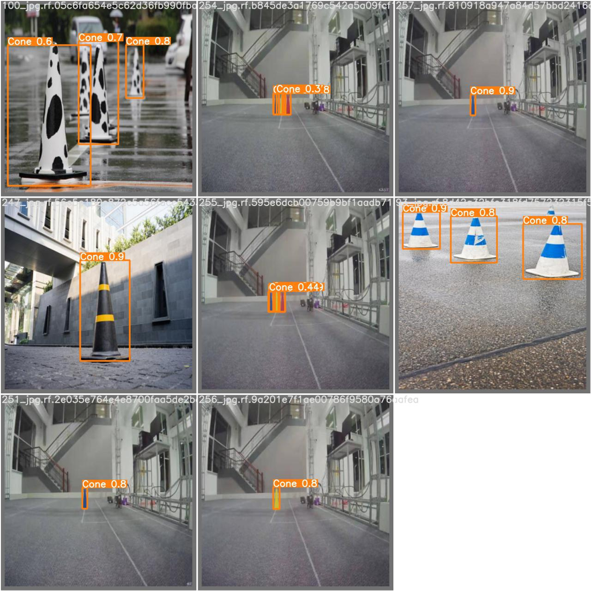
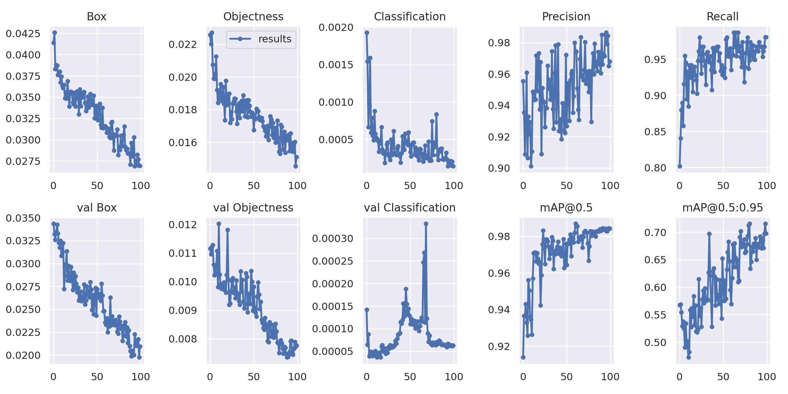
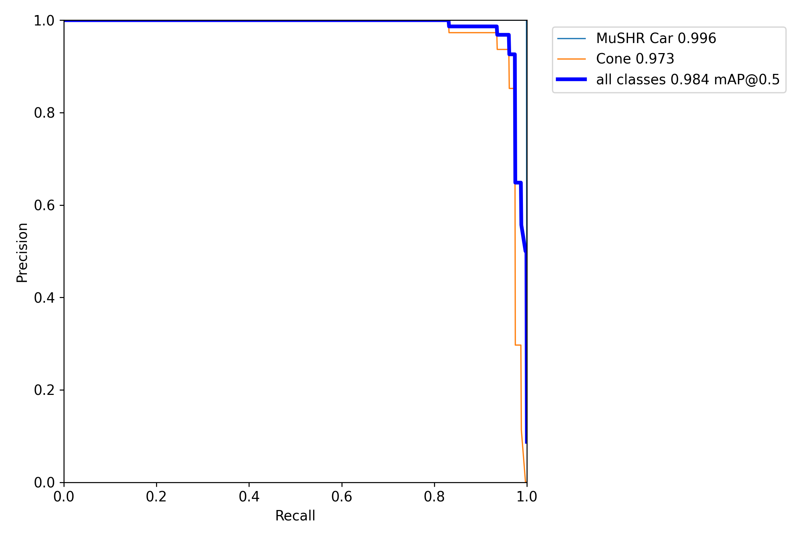

# YOLOv5-Cone-MuSHR-detection


### This repo contains the model for YOLOv5 cone/MuSHR car detection and the training datasets I built 


**Training Code:**

```
cd yolov5

python train.py --img 416 --epochs 50 --data cone.yaml --weights *Your pretrained weight here*

```


**Testing Code:**

```
python test.py --data test.yaml --weights *Your pretrained weight here*
```

Change the test.yaml file in data folder to use different validation images.

**To use the model for detection, use the following**

```
$ python detect.py --source 0  # webcam
                            file.jpg  # image 
                            file.mp4  # video
                            path/  # directory
                            path/*.jpg  # glob
                            'https://youtu.be/NUsoVlDFqZg'  # YouTube video
                            'rtsp://example.com/media.mp4'  # RTSP, RTMP, HTTP stream
		   --weights runs/train/MuSHR/exp3/weights/best.pt
```

**To train your own model, check the following tutorial**
https://github.com/ultralytics/yolov5/wiki/Train-Custom-Data

### Weights:
**best.pt** can be replaced by **last.pt** or **best.pt** from different runs in the **runs** folder.

Data for each run can be found in **runs** folder.


## Pretrained Models
My final model can be found here: 
https://drive.google.com/drive/folders/1MjygiqN6K0NnJnVZeno591807APKeh0V?usp=sharing

## Datasets
Check ```/datasets/```

**Traffic Cones**

**MuSHR car dataset**



## Augmentation

**I later added 50% grayscale**
## Work Process


## Evaluation Methods

Models are mainly evaluated with precision and mean average precision.

**Experiment 1**
Configuration: Default




In the first experiment I found that the although model has a good performance over all, it performances much better on orange cones than on cones with special colors. I am sure this is caused by a lack of data since there are only 8 out of 251 cone data contains special-colored cones.

**Normal Cones**


**Special Cones**


 **This is a serious issue to be addressed because we might use MuSHR cars of different color in our experiment. We might not be able to collect equally large amount of data for MuSHR cars of each color, but we need to detect all of them.**
 
Since the cones are only different in color and have similar shapes. I tried to add an extra data augmentation step to make the dataset 50% grayscale. This methods showed promising results/

**Special Cones after using 50% Grayscale, trained for 50 epochs**


Training with grayscale image could help increase model's performance on detecting objects of different color, which is underrepresented or not included at all in the training dataset. I then trained the model for longer, eventually I got to a really good point.

**Final Results**



## Final Weights
See ```/weights```
## Inference
**Model inference result on our testing video**
**https://drive.google.com/file/d/1qHjFCFF1cE0QG9qbMA0WN8k8D-bhe5he/view?usp=sharing**

## CSE 490 intro video
**https://drive.google.com/file/d/14O_ILRUz7pAFKpu8n-GHeqIo81ig06jA/view?usp=sharing**

## Reference
YOLOv5 by Ultralytics
	https://github.com/ultralytics/yolov5
	
The source of cone data:
	https://github.com/MarkDana/RealtimeConeDetection

Where the author labelled cone dataset: 
	https://www.dropbox.com/s/fag8b45ijv14noy/cone_dataset.tar.gz?dl=0

The labelled dataset (In PASCAL VOC format, and YOLOv3 format):
	https://jbox.sjtu.edu.cn/v/link/view/5b75acf81cbd4e3298aa118c1b1cceea

Which I later converted to darknet format for Yolov5


