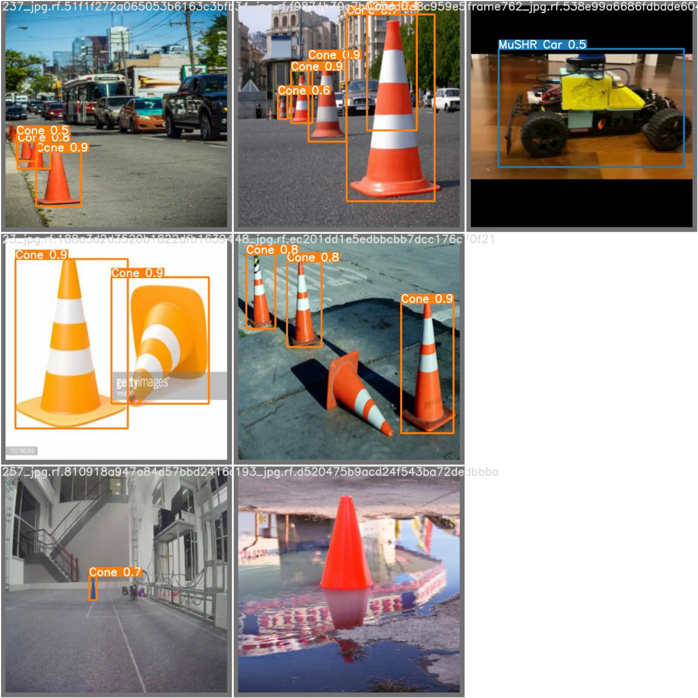
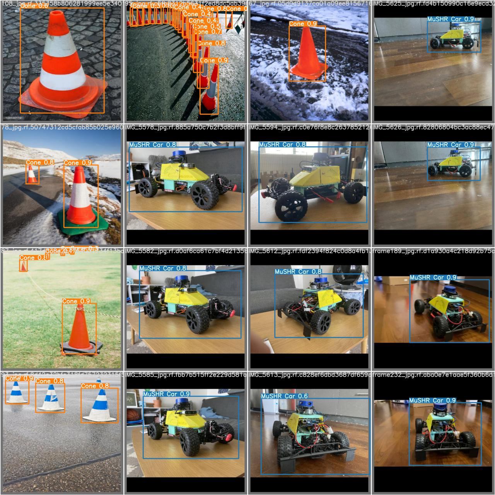
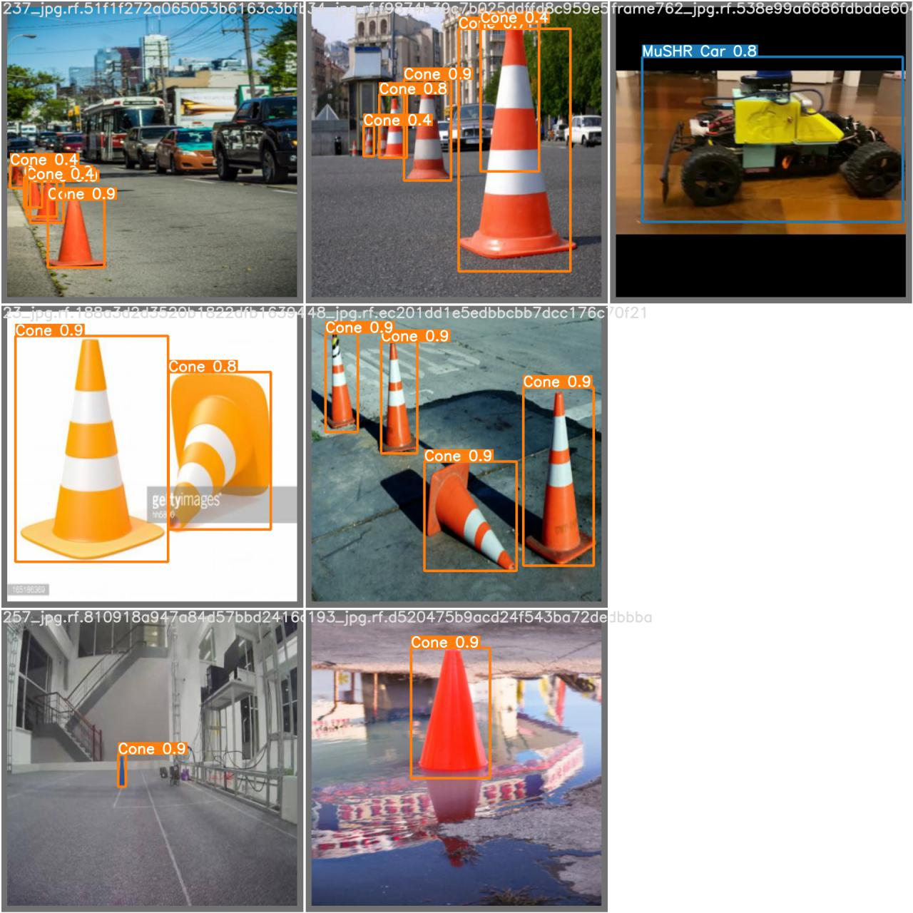
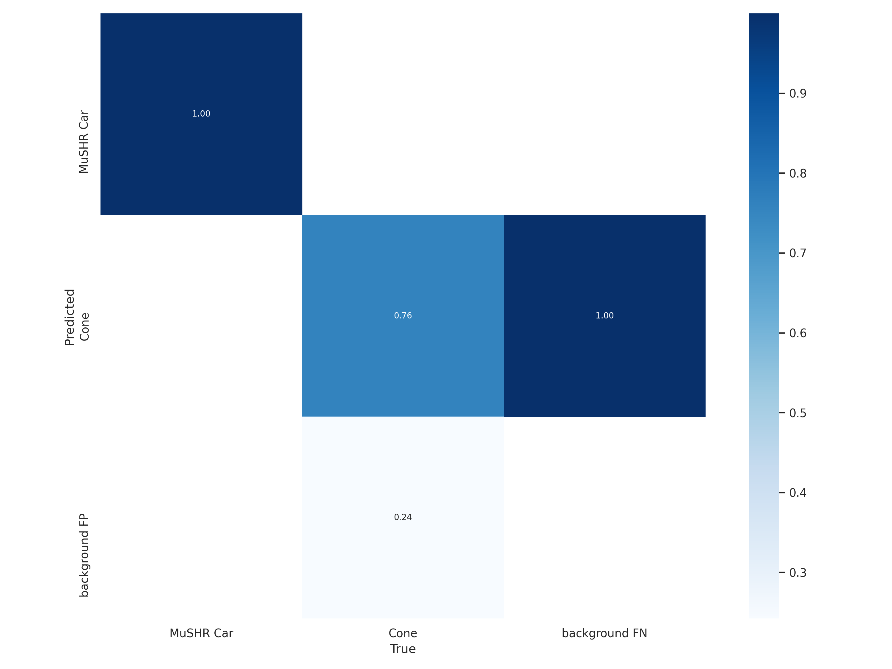

# YOLOv5-s-detection


### This repo contains the model for YOLOv5 cone/MuSHR car detection and the training datasets


**The pretrained model is trained by using the following code:**

```
cd yolov5

python train.py --img 640 --batch 16 --epochs 5 --data cone.yaml --weights best.pt

```
...

**To train your own model, follow the following tutorial**
https://github.com/ultralytics/yolov5/wiki/Train-Custom-Data

...

**To test the model, use the following**

```
python test.py --data test.yaml --weights your_weights_file.pt
```

Change the test.yaml file in data folder to use different validation images.

...

**best.pt** can be replaced by **last.pt** or **best.pt** from different runs in the **runs** folder.

Data for each run can be found in **runs** folder.

**To use the model for detection, use the following**

```
$ python detect.py --source 0  # webcam
                            file.jpg  # image 
                            file.mp4  # video
                            path/  # directory
                            path/*.jpg  # glob
                            'https://youtu.be/NUsoVlDFqZg'  # YouTube video
                            'rtsp://example.com/media.mp4'  # RTSP, RTMP, HTTP stream
		   --weights runs/train/MuSHR/exp3/weights/best.pt
```

## Pretrained Models
My trained model can be found here: 
https://drive.google.com/drive/folders/1o2Ki7_-_h7GKqqWzU0DaY8wpcdFtzdfV?usp=sharing

## Datasets
The MuSHR dataset is in ```mushr_dataset2```.
The cone dataset is in ```Cone_dataset``` and ```Cone_gray```.


## Most Recent work

In my previous work I found that training with grayscale image could help increasing model's performance on detecting objects of different color, which is underrepresented or not included at all in the training dataset. The latest model in this repo detects both the MuShr car and traffic cones. The model is first trained with grayscale dataset. The result shows some false positve detections for cones. To resolve this, I did transfer training on this model with the colored dataset. The result shows significant improvement in the model's ability to correctly detect objects. However, the problem of false positives still exists. **(More details and metrics can be found in the image folder)**

**Model 1 (trained on grayscaled images alone)**

**Model 1 Predictions**



**Model 1 Performance**


**Model 2 (Trained on grayscaled + colored images)**

**Model 2 Predictions**



**Model 2 Performance**



The source of data is this repo:
	https://github.com/MarkDana/RealtimeConeDetection

Where the author labelled cone dataset: 
	https://www.dropbox.com/s/fag8b45ijv14noy/cone_dataset.tar.gz?dl=0

The labelled dataset (In PASCAL VOC format, and YOLOv3 format):
	https://jbox.sjtu.edu.cn/v/link/view/5b75acf81cbd4e3298aa118c1b1cceea

Which I later converted to darknet format for Yolov5


------------------------------------------------------------------------

03/09/2021 Update

Trying out some image augmentation Using Albumentations: https://albumentations.ai/docs/getting_started/bounding_boxes_augmentation/

It supports the yolo darknet format for bounding box data.

I will train a new model with augmented dataset soon.


